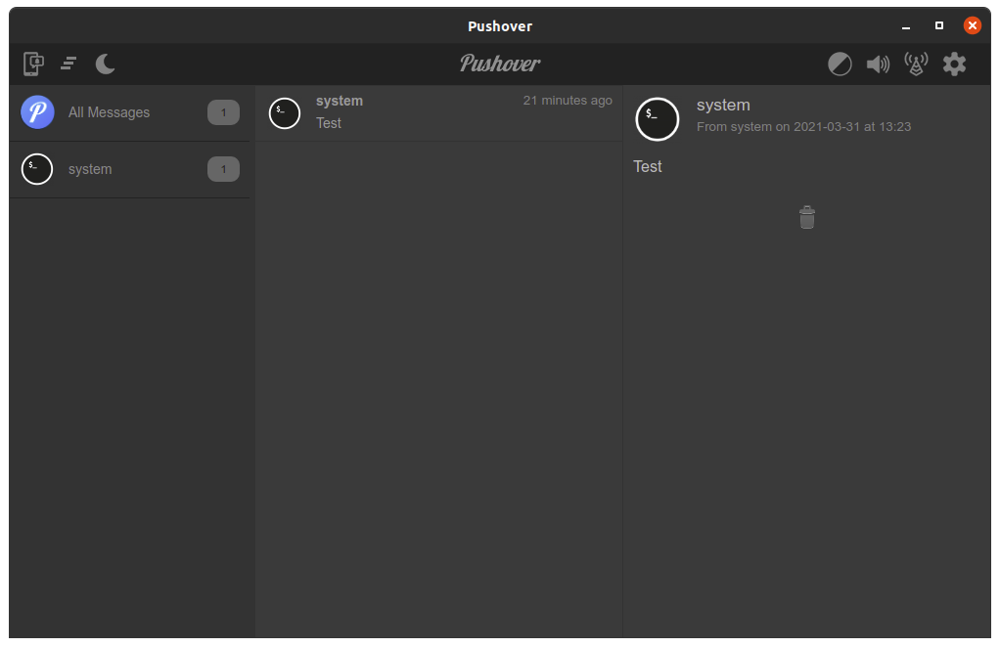

# Pushover Desktop

An electron wrapped Pushover.net desktop application.

<table border=0 padding=1>
   <tr>
     <td></td>
  </tr>
</table>

## Usage

Download the latest release from: https://github.com/Fmstrat/pushover-desktop/releases

- After your first login, you will be taken to the Pushover console
- Go to `Desktop` in the top nav, and register your device
- From here out, every time you open Pushover you will be taken to the client display

## Compiling yourself
Docker is required to build images.

Create the nativefier image for docker:
``` bash
./makeApps.sh build
```

Run the build:
``` bash
./makeApps.sh
```

## Ubuntu icon/shortcut
The `shortcuts/pushover.desktop` file can be used as a shortcut from GNOME.

## Windows icon fix

If issues exist with the launch icon in Windows, use Rcedit from: https://github.com/electron/rcedit/releases
```
rcedit-x64.exe "C:\Program Files\Pushover\Pushover.exe" --set-icon resources/icon.png
```
